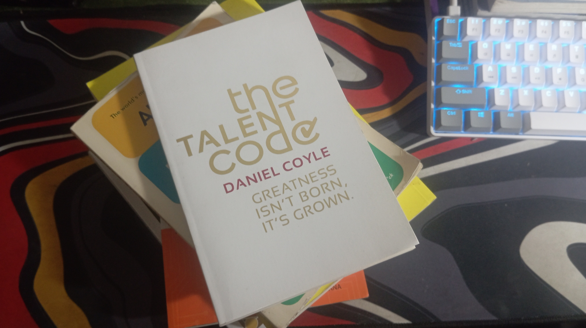

What are [skills](https://www.ag5.com/what-are-skills/) ? Usually people who master skills usually start from curiosity and eventually become a hobby, the longer they become experts. Like me, I am good at drawing, at first I often watch cartoons, it developed into a hobby, until now I can and am free to draw whatever I want. One of my other skills is fast typing. Compared to others I can type fast, I can type up to 130 wpm+ and that is one of my skills. Having several skills can make you stand out from others. Do you know how to master a skill? I was given an interesting book by my lecturer because I got a pretty high weekly exam score🗿

I received this gift from my lecturer a few months ago, and recently I took the time to read it through. Instead of reviewing (because there are already many reviews out there), I want to write specifically about the skills of this book, this is also an exercise for my writing skills.

---

This study explores the commonalities between Beyonce Michael Jordan and Stephen Hawking, as identified in the book "Talent Code." It reveals that talented individuals possess an abundance of myelin in their brains. [Myelin](https://www.ucl.ac.uk/news/2014/oct/myelin-vital-learning-new-practical-skills) acts like a muscle that stores a specific skill, with thicker myelin indicating greater skill. The key to developing this muscle is through focused action and practice. The study suggests that once developed, myelin remains in the brain for life, making it crucial for anyone interested in enhancing their talent.

Myelin can be likened to a specialized muscle in the brain that stores and enhances certain skills. The thicker the myelin sheath surrounding the neural pathways associated with a particular ability, the more proficient a person becomes in that area. Simply put, when we practice or engage in any skill, we stimulate myelin growth. This biological mechanism explains why these seemingly disparate figures like pop stars, basketball stars, and scientists are so talented in their areas.
## Mastery is about deep practice

Talent is the result of deep practice. The best way to learn is with deliberate practice where you push yourself to the edge constantly. The more you practice deliberately, the faster and better you learn.

Everyone knows that practice is a key to success. What everyone doesn't know is that specific kinds of practice can increase skill up to ten times faster than conventional practice.

***Practice makes perfect***, indeed accurate but only if you practice in the right way, simply repeating a task won't lead to Improvement but making mistakes and correcting them will, when you practice beyond your current abilities, the nerves in your brain will light up through the circuits and the Myelin layer around the circuits becomes thicker. That’s where what the author calls deep practice comes in. It’s based on three things:

1. Repetition.
2. Making mistakes.
3. Fixing them.

Whatever you’re practicing, break the skill into manageable chunks and focus on mastering each one individually before integrating them. Practice slowly and correctly, using mistakes as learning opportunities, since repeating mistakes can reinforce them. Consistent and proper repetition is essential for building competence and ultimately mastering the skill.

For example, I'm currently learning a new language. This involves breaking down the process into chunks: mastering vocabulary, understanding grammar rules, practicing pronunciation, and engaging in conversations. Trying to learn everything at once would be overwhelming and counterproductive. It will still take time to become fluent, but by focusing on one aspect at a time, the learning process becomes more manageable. 

>**Divide your practice into tiny units, so you can fix your mistakes on the smallest scale**.

Additionally, Josh Kaufman's ["The First 20 Hours"](https://wanderingaimfully.com/146-2/#:~:text=1.,a%20song%20in%2020%20hours.) highlights that with focused and deliberate practice, you can become reasonably proficient in a new skill in just 20 hours. This emphasizes the importance of breaking down the learning process and dedicating consistent, concentrated effort.
## Future Belonging - Ignition 

Ignition is a bit similar to motivation; we all need it to get things started. However, what separates truly high achievers from the rest of the pack? A higher level of commitment call it [passion](https://medium.com/@sargam0122/what-is-passion-f731df8e0cb) born out of our deepest unconscious desires and triggered by certain primal cues. Understanding how these signals work can help you ignite passion and catalyze skill development.

> _“High motivation is not the kind of language that ignites people. What works is precisely the opposite: not reaching up but reaching down, speaking to the ground-level effort, affirming the struggle.”_ Daniel Coyle
## Coaching 
Deep practice and ignition are essential for developing skills. However, it’s equally vital to have the guidance of the right mentor(s) to direct your efforts effectively.

Coaches and mentors play pivotal roles in skill development, providing invaluable guidance tailored to individual strengths and weaknesses. They not only offer structured feedback but also impart wisdom accumulated through experience. This personalized direction helps navigate challenges more effectively and accelerates learning by focusing on refining specific aspects of the skill set.

---

The book "Talent Code" provides valuable insights into how myelin plays a role in skill development, showing that talent is not something that only a privileged few have, but rather something that can be built upon and developed. Start with curiosity, develop it into a hobby, and with consistent and proper practice, you can hone your skills to an expert level. Whether you're learning a new language, improving your typing skills, or pursuing another passion, these principles can be applied.

So, get started today
