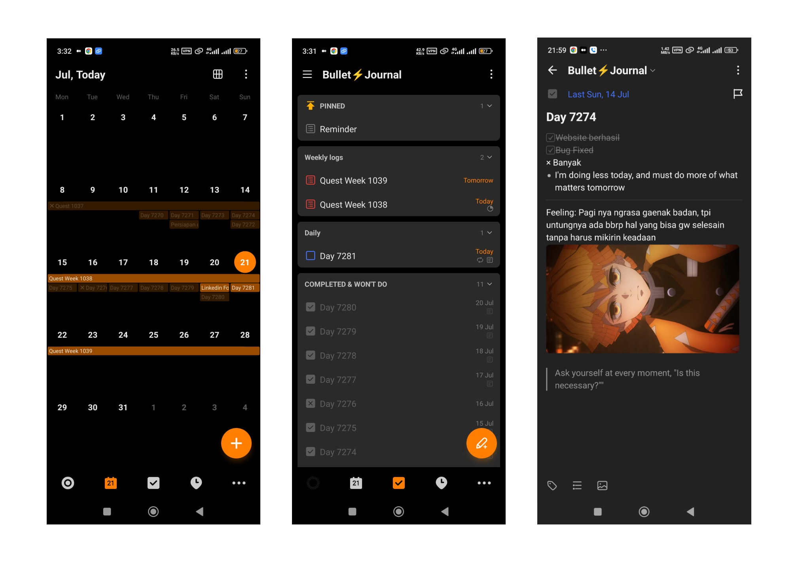

I'm going to keep this as concise and to the point. I really enjoy the idea of ​​journaling, but I don't enjoy how complicated and time consuming it can often end up becoming. The idea of ​​tracking tasks and tracking patterns is really powerful but it needs to be simple, or else it becomes unsustainable and overwhelming.

If you've heard of Ryder Carroll's Bullet Journal method using notebooks, here I've adapted and simplified a few things. It's actually a [hybrid system](https://blog.workflowy.com/gtd-vs-bullet-journal/) with [GTD method](https://gettingthingsdone.com/what-is-gtd/) However, if you're just starting to journal, there are some important things to know.
## Intro to Journaling
If you are still a beginner in journaling, it's important to understand that developing habits and routines can significantly impact your life. While it might not seem necessary at first, establishing a regular journaling practice can provide structure and clarity.

**The best part about journaling is that you can design a system that works for you**

By making journaling a part of your daily routine, you create a dedicated time for self-reflection, goal setting, and tracking progress. This habit keeps you organized, aware, and on track, leading to your personal growth and well-being.
## What application should I use?
What I mean is, use applications that you often use. Using a new tool is often difficult to get you to open the application regularly. So, why not just use the apps you use most often?

For example, if you have a notebook nearby and frequently write, use that instead. No need to buy a new book specifically for journaling. Or if you often use WhatsApp, create a group that only contains you and name the group "Journaling" or "Note", no need to install new applications. This will make the journaling process more natural and easier to carry out. That way, you can write your important things.

I have tried many applications, and the most suitable one, I use [Ticktick](https://ticktick.com), because
- Fast and offline functionality
- Markdown notes
- Support Daily Habit 
- Support recurring tasks
- Calendar, kanban, list view
- 
Lots of features, but still quite simple and all the features are really useful. My favorites are simple notes and simple but powerful tasks, here I can make both of them into one folder with the name Bullet⚡Journal.
## Daily

> _I_ once read that “_you write_ in _order_ to _learn_ how to _think_.” _Journaling_ is a _great way_ to _get_ in the _habit_ of _writing_.

Let's focus on weekly and daily. There are definitely Tasks, Events, Notes, and even Feelings in our daily lives, and it is important for us to. There is a term called [Rapid Logging](https://bulletjournal.com/blogs/faq/what-is-rapid-logging-understand-rapid-logging-bullets-and-signifiers) which is designed to capture and categorize our thoughts quickly.

This is My daily template
```markdown
- [x]  Todo
x Not do
- Notes
---  
Feeling: 
> Quote
```

The first part is a simple reflection, I reflect on what I have done and my own mistakes and then turn them into valuable learning experiences. The notes part is important to add notes, it's a reminder for tomorrow, evaluate important things, this part is as short as do and don't.

The second part is the core of the journaling, this method I got from a short video of someone on Instagram, where he added feelings in his bullet journal. Feeling section where I write down my emotions that day in the form of storytelling. Then the quote tells the exact wording of a statement from a source or we definitely learn something new every day, or maybe we conclude something on that day, in one sentence we learn something. This is what we focus on if one day we review our journaling that has passed.

## Bullet⚡Journaling

I have been regularly writing digital journals for weeks, using the number as a reminder of my life's passage. I use an age calculator (https://www.calculator.net/age-calculator.html) for automatic calculations. Additionally, I've included a Reminder section to remind me of important tasks not listed in the calendar, like job recruitment and campus events.
## In addition to practicing self-exploration skills
It is very important for us to understand ourselves, self exploration. By journaling regularly we can keep track of the number of days we have lived, making us grateful for what we got today, so we can improve to know what was lacking yesterday and what needs to be improved the next day.

